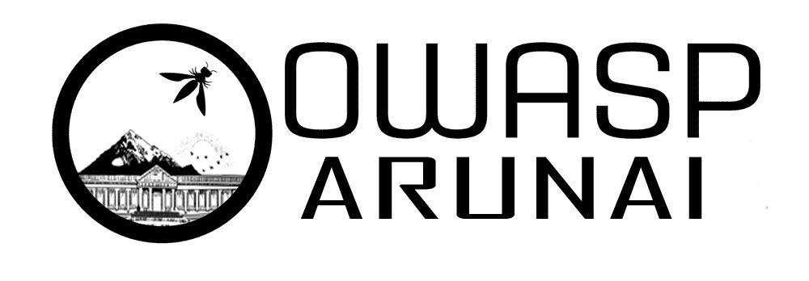

---

layout: col-sidebar
title: OWASP Arunai Engineering College - Student Chapter
tags: arunai
region: Asia
meetup-group: OWASP Arunai Engineering College Chapter

---

## Welcome
Welcome to <b>OWASP Arunai Engineering  College </b> was founded in September,2021. We organise Meetups, Webinar and Conferences. All these event are open, anyone who is interest can participate. We promote on Secure Application Development and share knowleadge on Cyber Security. Join our mission to make Cyber Space a Better Place!

## Participation
The Open Web Application Security Project (OWASP) is a nonprofit foundation that works to improve the security of software. All of our projects ,tools, documents, forums, and chapters are free and open to anyone interested in improving application security. 

Chapters are led by local leaders in accordance with the [Chapters Policy](/www-policy/operational/chapters). Financial contributions should only be made online using the authorized online donation button. To be a SPEAKER at ANY OWASP Chapter in the world simply review the [speaker agreement](/www-policy/legal/speaker-agreement) and then contact the local chapter leader with details of what OWASP Project, independent research, or related software security topic you would like to present.

Everyone is welcome and encouraged to participate in our [Projects](/projects/), [Local Chapters](/chapters/), [Events](/events/), [Online Groups](https://groups.google.com/a/owasp.com/){:target='_blank'}, and [Community Slack Channel](https://owasp.slack.com/){:target='_blank'}. We especially encourage diversity in all our initiatives. OWASP is a fantastic place to learn about application security, to network, and even to build your reputation as an expert. We also encourage you to be [become a member](/membership/) or consider a [donation](/donate/) to support our ongoing work.
### Arunai Student Chapter inauguration
We Arunai-Computer Science Engineering part of #ARUNAI_ENGINEERING_COLLEGE , move forward towards the next  steps by inaugurate the Cyber Security Club in the name of #OWASP Arunai Engineering College - Student Chapter ( https://owasp.org/www-chapter-arunai-engineering-college/ ) on 08th October @10:30 am through Online Mode. 

In the Presence of Our Respected Vice-Chairman Er.E.V.Kumaran , Respected Registrar Dr.R.Sathiyaseelan, Felicitation Address by our Respected & beloved Principal Dr.R.Ravichandran , 
Welcome address by Dr.M.Jothish Kumar, Head, Department of Computer Science and Engineering.
Mr.Vimal Mani started his session with a brief talk on Cyber Space, Cyber Attack & Cyber Security. Sir also suggested Cyber Certificate Course for the students which help them to improve their professional platform. He also added a key point regarding malware & ransomware . Sir told that 70% of Malware attack will reach by email in the form of spam mail.
Mr. Akarakaviyarasan started his session like how organization need secure by concentrating with following key points like Network Communication Security Tools, Monitor & improve organization security, Prevent access control attacks and Backup of data. 
Students interact with our chief guest through chat by posting queries which is an interactive session.
<b>Student Chapter Coordinators</b>

Mr.Karthikeyan Sivakumar IV Year CSE

Mr.Anbarasan Annamalai IV Year CSE
Finally Chief Guest congrats the Team Member of Cyber Security Club of Arunai Engineering College and assure that students can clarify their doubts in future to face the challenges in Cyber Attacks.

#cyber #malware #security #backup #club #arunai #TogetherWeCan #faculty #student

We schedule our meetings on the [OWASP-Arunai Engineering College-Student Chapter Meetup Group](https://www.meetup.com/owasp-arunai-engineering-college-chapter)
<b>Chief Guest </b>
Mr.Vimal Mani,
Head of Information Security ,
Bank of Sharjah, United Arab Emirates.

Mr.Akarakaviyarasan ,
Senior Project Manager,Citibank (ASPAC & EMEA) ,
Bahrain

## Speakers
If you like to speak on our upcoming events, Kindly mail us

* [OWASP Arunai Engineering College](mailto:suresh.rajendran@owasp.org)

---

### Check our Upcoming Meetup Events:


## Contact Us:

 
